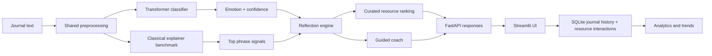

# Emotion Journal Assistant

Emotion Journal Assistant is a recruiter-facing applied AI project that turns a notebook prototype into a small product: a six-class emotion classifier, a guided reflection engine, a curated coping-resource layer, a constrained coach, a FastAPI backend, a Streamlit dashboard, SQLite persistence, and a reproducible training pipeline.

If you are new to the codebase, start with [`docs/TECHNICAL_GUIDE.md`](docs/TECHNICAL_GUIDE.md). It is a from-zero technical walkthrough of the architecture, packages, modules, background concepts, and runtime flow. For a study plan with textbooks, videos, and official docs mapped to this project, use [`docs/LEARNING_RESOURCES.md`](docs/LEARNING_RESOURCES.md).

## Why this project is stronger than a notebook

- It ships a real product flow instead of only model experiments.
- It compares a transparent baseline against a fine-tuned transformer and promotes the better model by macro F1.
- It stores journal history, resource interactions, and exposes an API, which makes the project feel like software rather than coursework.
- It is framed as a wellness reflection tool, not therapy or diagnosis.

## Product framing

This app is intentionally non-clinical. It offers journaling support, emotion classification, structured follow-up prompts, curated coping links, and a guided reflection coach. If a journal entry contains acute crisis language, the app switches from ordinary reflection prompts to a safety response that points the user toward urgent help, including 988 in the United States.

## Project structure

```text
.
├── app/streamlit/app.py
├── artifacts/
│   ├── models/
│   └── reports/
├── scripts/train.py
├── src/emotion_journal/
│   ├── analytics.py
│   ├── api.py
│   ├── config.py
│   ├── db.py
│   ├── model.py
│   ├── preprocessing.py
│   ├── recommendations.py
│   └── schemas.py
└── tests/
```

## Architecture



## Model approach

- Dataset: `dair-ai/emotion`
- Labels: `sadness`, `joy`, `love`, `anger`, `fear`, `surprise`
- Shared preprocessing: lowercase, URL removal, punctuation removal, whitespace normalization
- Classical benchmarks: TF-IDF + Logistic Regression and TF-IDF + LinearSVC
- Production candidate: fine-tuned `distilroberta-base` in PyTorch / Hugging Face Transformers
- Explainability layer: the strongest classical linear model is kept alongside the transformer to surface phrase-level reasons for a prediction
- Selection rule: choose the model with the higher macro F1 on the test split

### Current trained result

- Selected production model: `distilroberta-base`
- Selected classical explainer: `tfidf-linearsvc`
- Logistic Regression test metrics: `0.8295` accuracy / `0.7264` macro F1
- LinearSVC test metrics: `0.8795` accuracy / `0.8224` macro F1
- Transformer test metrics: `0.9000` accuracy / `0.8600` macro F1

## What the app returns

For each journal entry, the product returns:

- detected emotion
- numeric confidence and confidence band (`high`, `medium`, `low`)
- a one-line reflection summary
- a short interpretation of what the model may be picking up
- exactly three follow-up journaling prompts
- phrase-level explanation chips from the baseline explainer
- curated links for watching, reading, playing, or moving
- a guided coach opening plus finite-state follow-up messages
- a safety fallback when crisis language is detected

## Quickstart

1. Create a virtual environment:

   ```bash
   python3 -m venv .venv
   source .venv/bin/activate
   ```

2. Install dependencies:

   ```bash
   python -m pip install -r requirements.txt
   ```

3. Train artifacts:

   ```bash
   PYTHONPATH=src python scripts/train.py
   ```

   On first run, the script downloads `dair-ai/emotion` and the pretrained `distilroberta-base` checkpoint before fine-tuning.
   The default command preserves the current single-transformer workflow. To preview the expanded candidate configuration without training, run:

   ```bash
   PYTHONPATH=src python scripts/train.py --dry-run-candidates --transformers distilroberta-base,bert-base-uncased
   ```

   To train only the classical baselines, use `--skip-transformers`.

4. Run the API:

   ```bash
   PYTHONPATH=src uvicorn emotion_journal.api:app --reload
   ```

5. Run the Streamlit demo:

   ```bash
   PYTHONPATH=src streamlit run app/streamlit/app.py
   ```

6. Run tests:

   ```bash
   PYTHONPATH=src pytest
   ```

## FastAPI endpoints

- `GET /health`
- `POST /predict`
- `POST /entries`
- `PATCH /entries/{id}/feedback`
- `GET /entries`
- `GET /analytics`
- `GET /resources`
- `GET /resources/summary`
- `POST /resource-interactions`
- `POST /coach/respond`

### Example `POST /predict`

```json
{
  "text": "I feel lighter after spending the afternoon outdoors.",
  "location": "Vancouver",
  "activity": "walking"
}
```

### Example response

```json
{
  "emotion": "joy",
  "confidence": 0.91,
  "recommendation": "Anchor the bright spot before the day blurs together.",
  "model_name": "distilroberta-base",
  "confidence_band": "high",
  "reflection_summary": "The entry reads like relief paired with genuine lift.",
  "interpretation": "The model is picking up positive language around energy, ease, and a specific moment that felt restorative.",
  "follow_up_prompts": [
    "What exactly shifted your mood today?",
    "What do you want to remember about this feeling tomorrow?",
    "Which part of the day felt most earned?"
  ],
  "explanation_phrases": [
    "feel lighter",
    "outdoors"
  ],
  "resources": [
    {
      "id": "game_autodraw",
      "title": "AutoDraw",
      "resource_type": "game",
      "coping_style": "play"
    }
  ],
  "coach_opening": "I'm reading this as mostly joy right now. Do you want to unpack it, settle your system, or see something that might help immediately?",
  "coach_available": true,
  "disclaimer": "This tool offers reflective journaling support and emotion classification. It is not therapy, diagnosis, or medical advice.",
  "is_crisis": false,
  "scores": {
    "sadness": 0.01,
    "joy": 0.91,
    "love": 0.02,
    "anger": 0.02,
    "fear": 0.01,
    "surprise": 0.03
  }
}
```

## Streamlit pages

- `New Entry`: guided writing prompt, richer reflection output, resource preference picker, resource tabs, and a finite-state coach.
- `Resource Library`: browse the curated catalog by emotion, coping style, and resource type, with coverage and validation metrics.
- `History`: review saved entries, reflection summaries, confidence bands, coach path summaries, and suggested resources.
- `Insights`: inspect emotion distribution, trend buckets, confidence-band counts, common explanation phrases, and resource interaction patterns.
- `About the Model`: review transformer-vs-classical roles, optional coach mode, production metadata, and the evaluation report.

## Evaluation outputs

Running `scripts/train.py` creates:

- `artifacts/models/production.json`
- `artifacts/reports/evaluation.json`
- `artifacts/reports/evaluation.md`

These files give you a concrete story for interviews: what you trained, why the transformer won, where the classical models still matter, and how the explainability layer complements the production model.

## Deployment note

The Streamlit app is the first public demo target. Streamlit Community Cloud is a good fit for the UI, while FastAPI remains available locally in the repo for API walkthroughs and architecture discussion. See [`docs/STREAMLIT_CLOUD_DEPLOYMENT.md`](docs/STREAMLIT_CLOUD_DEPLOYMENT.md) for Python 3.9 settings, secrets, Git LFS model artifact guidance, and the local SQLite persistence caveat.

## Resume bullets

- Built an end-to-end emotion journaling assistant using FastAPI, Streamlit, SQLite, and a reproducible PyTorch / Hugging Face NLP pipeline on the `dair-ai/emotion` dataset.
- Benchmarked multiple classical linear models against a fine-tuned `distilroberta-base` classifier, selected the production model by macro F1, and documented tradeoffs with deployable artifacts.
- Added a safety-aware reflection engine, phrase-level explainability, curated coping resources, and a constrained coach to turn a notebook prototype into a portfolio-ready applied AI product.
