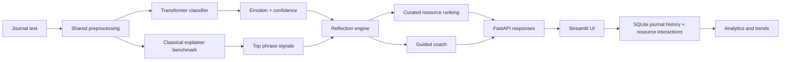

# JournalPulse

JournalPulse is a recruiter-facing applied AI project that turns a notebook prototype into a polished demo product: a six-class emotion classifier, a guided reflection engine, a curated coping-resource layer, a constrained coach, a FastAPI backend, a Streamlit dashboard, SQLite persistence, and a reproducible training pipeline.

If you are new to the codebase, start with [`docs/TECHNICAL_GUIDE.md`](docs/TECHNICAL_GUIDE.md). It is a from-zero technical walkthrough of the architecture, packages, modules, background concepts, and runtime flow. For safety, deployment, and demo context, see [`docs/ARCHITECTURE.md`](docs/ARCHITECTURE.md), [`docs/PRIVACY.md`](docs/PRIVACY.md), [`docs/SAFETY_AND_LIMITATIONS.md`](docs/SAFETY_AND_LIMITATIONS.md), [`docs/MODEL_CARD.md`](docs/MODEL_CARD.md), [`docs/DEMO_SCRIPT.md`](docs/DEMO_SCRIPT.md), [`docs/PRODUCTION_DEPLOYMENT.md`](docs/PRODUCTION_DEPLOYMENT.md), and [`docs/STREAMLIT_CLOUD_DEPLOYMENT.md`](docs/STREAMLIT_CLOUD_DEPLOYMENT.md).

## Why this project is stronger than a notebook

- It ships a real product flow instead of only model experiments.
- It compares a transparent baseline against a fine-tuned transformer and promotes the better model by macro F1.
- It stores journal history, resource interactions, and exposes an API, which makes the project feel like software rather than coursework.
- It is framed as a wellness reflection tool, not therapy or diagnosis.

## Why this is portfolio-ready

- Architecture: modular training, API, UI, persistence, resource ranking, and analytics layers.
- Safety: crisis detection, non-clinical boundaries, deterministic coach fallback, and no raw coach transcript persistence.
- Evaluation: classical baselines, transformer metrics, calibration-ready artifacts, and a model card.
- Deployment: Streamlit Cloud docs, Git LFS artifact strategy, seeded demo data for empty sessions, and CI checks.
- Product polish: resource credibility badges, goal-based routing, "why this resource" explanations, and a recruiter demo script.

## Production-minded deployment shape

JournalPulse now supports two runtime modes:

- Local demo mode: Streamlit calls in-process Python services.
- Split deployment mode: set `JOURNALPULSE_API_BASE_URL` and Streamlit calls a deployed FastAPI backend.

The production case-study target is:

```text
Streamlit Community Cloud frontend
+ Render FastAPI backend
+ Hugging Face Hub transformer artifacts
+ Supabase Postgres/Auth later
```

FastAPI exposes `/health` for process health and `/ready` for model/database/resource readiness.

## Product framing

This app is intentionally non-clinical. It offers journaling support, emotion classification, structured follow-up prompts, curated coping links, and a guided reflection coach. If a journal entry contains acute crisis language, the app switches from ordinary reflection prompts to a safety response that points the user toward urgent help, including 988 in the United States.

## Project structure

```text
.
├── app/streamlit/app.py
├── artifacts/
│   ├── models/
│   └── reports/
├── scripts/train.py
├── src/emotion_journal/
│   ├── analytics.py
│   ├── api.py
│   ├── coach.py
│   ├── config.py
│   ├── db.py
│   ├── llm.py
│   ├── model.py
│   ├── preprocessing.py
│   ├── recommendations.py
│   ├── resources.py
│   └── schemas.py
└── tests/
```

## Architecture


```mermaid
flowchart LR
    A["Journal text"] --> B["Shared preprocessing"]
    B --> C["Transformer classifier"]
    B --> D["Classical explainer benchmark"]
    C --> E["Emotion + confidence"]
    D --> F["Top phrase signals"]
    E --> G["Reflection engine"]
    F --> G
    G --> H["Curated resource ranking"]
    G --> I["Guided coach"]
    H --> J["FastAPI responses"]
    I --> J
    J --> K["Streamlit UI"]
    K --> L["SQLite journal history + resource interactions"]
    L --> M["Analytics and trends"]
```

## Model approach

- Dataset: `dair-ai/emotion`
- Labels: `sadness`, `joy`, `love`, `anger`, `fear`, `surprise`
- Shared preprocessing: lowercase, URL removal, punctuation removal, whitespace normalization
- Classical benchmarks: TF-IDF + Logistic Regression and TF-IDF + LinearSVC
- Production candidate: fine-tuned `distilroberta-base` in PyTorch / Hugging Face Transformers
- Explainability layer: the strongest classical linear model is kept alongside the transformer to surface phrase-level reasons for a prediction
- Selection rule: choose the model with the higher macro F1 on the test split

### Current trained result

- Selected production model: `distilroberta-base`
- Selected classical explainer: `tfidf-linearsvc`
- Logistic Regression test metrics: `0.8295` accuracy / `0.7264` macro F1
- LinearSVC test metrics: `0.8795` accuracy / `0.8224` macro F1
- Transformer test metrics: `0.9000` accuracy / `0.8600` macro F1

## What the app returns

For each journal entry, the product returns:

- detected emotion
- numeric confidence and confidence band (`high`, `medium`, `low`)
- a one-line reflection summary
- a short interpretation of what the model may be picking up
- exactly three follow-up journaling prompts
- phrase-level explanation chips from the baseline explainer
- curated links for watching, reading, playing, or moving, with source badges and rationale text
- a guided coach opening plus finite-state follow-up messages, tips, suggested replies, and resource intent
- a safety fallback when crisis language is detected

## Quickstart

1. Create a virtual environment:

   ```bash
   python3 -m venv .venv
   source .venv/bin/activate
   ```

2. Install dependencies:

   ```bash
   python -m pip install -r requirements.txt
   ```

3. Train artifacts:

   ```bash
   PYTHONPATH=src python scripts/train.py
   ```

   On first run, the script downloads `dair-ai/emotion` and the pretrained `distilroberta-base` checkpoint before fine-tuning.
   The default command preserves the current single-transformer workflow. To preview the expanded candidate configuration without training, run:

   ```bash
   PYTHONPATH=src python scripts/train.py --dry-run-candidates --transformers distilroberta-base,bert-base-uncased
   ```

   To train only the classical baselines, use `--skip-transformers`.

4. Run the API:

   ```bash
   PYTHONPATH=src uvicorn emotion_journal.api:app --reload
   ```

5. Run the Streamlit demo:

   ```bash
   PYTHONPATH=src streamlit run app/streamlit/app.py
   ```

6. Run tests:

   ```bash
   PYTHONPATH=src pytest
   ```

7. Validate the resource catalog:

   ```bash
   PYTHONPATH=src python scripts/validate_resources.py
   ```

   To make online link requests, add `--check-links`.

### OpenRouter-powered reflection agent

The deterministic coach and calibrated artifact classifier are the defaults and work without secrets. The core AI-helper path uses an OpenAI-compatible structured agent, with OpenRouter as the preferred provider for v1:

```text
JOURNALPULSE_LLM_MODE=structured
JOURNALPULSE_LLM_API_KEY=...
JOURNALPULSE_LLM_BASE_URL=https://openrouter.ai/api/v1
JOURNALPULSE_LLM_MODEL=google/gemma-3-27b-it
JOURNALPULSE_LLM_APP_URL=https://your-demo-url.example.com
JOURNALPULSE_LLM_APP_TITLE=JournalPulse
```

Supported modes are `off`, `rewrite`, and `structured`. In structured mode, the agent returns validated JSON for assistant text, practical steps, suggested replies, resource intent, optional communication draft, reflection question, confidence note, and allowed resource IDs. Crisis mode always bypasses LLM generation.

**Dynamic resource recommendations.** Whenever an LLM is configured (any non-`off` mode) and the user opts in, JournalPulse also re-ranks the curated catalog for the specific entry and proposes a few fresh, personalized suggestions ("AI-suggested" cards). Generated links are constrained to a vetted domain safelist (`RESOURCE_DOMAIN_SAFELIST` in `config.py`), de-duplicated, and never shown in crisis mode. Without a key, recommendations stay catalog-only but are still content-aware (ranked against what you wrote). Any LLM failure silently falls back to the catalog.

To use a stronger generative model as the emotion classifier, expose it through an OpenAI-compatible chat-completions endpoint and set:

```text
JOURNALPULSE_CLASSIFIER_MODE=llm
JOURNALPULSE_LLM_API_KEY=...
JOURNALPULSE_LLM_BASE_URL=https://your-openai-compatible-endpoint/v1
JOURNALPULSE_LLM_MODEL=your-gemma-or-llm-model
```

Supported classifier modes are `calibrated`, `llm`, and `hybrid`. `calibrated` (default) uses the local transformer plus journal-aware calibration. `llm` replaces the prediction with the model's structured output. `hybrid` (recommended when a key is available) **blends** the calibrated transformer scores with the LLM scores (a weighted average), so the model grounds the distribution while the LLM adds nuance. The LLM classifier returns a strict JSON shape validated by Pydantic. If the endpoint is missing, returns invalid JSON, or the entry triggers crisis mode, JournalPulse falls back to the calibrated artifact and records the fallback reason.

### Deployment environment variables

```text
JOURNALPULSE_ENV=production
JOURNALPULSE_DEPLOYMENT_MODE=api
JOURNALPULSE_API_BASE_URL=https://your-api.example.com
JOURNALPULSE_DB_PATH=/data/journalpulse.db   # a persistent disk; /tmp is wiped on restart
JOURNALPULSE_HF_MODEL_ID=your-name/journalpulse-emotion-distilroberta
JOURNALPULSE_CLASSIFIER_MODE=calibrated
JOURNALPULSE_LLM_BASE_URL=https://openrouter.ai/api/v1
JOURNALPULSE_ADMIN_MODE=false
```

`JOURNALPULSE_API_BASE_URL` is used by Streamlit. `JOURNALPULSE_HF_MODEL_ID` is used by the FastAPI backend to load transformer weights from Hugging Face Hub instead of local `model.safetensors` — **required for any deployment**, since the ~300 MB weights are not committed to git. Push them once with `huggingface-cli upload <user>/<model> artifacts/models/transformer_model`. `JOURNALPULSE_DB_PATH` should point at a persistent disk (see `render.yaml`); `/tmp` is ephemeral and loses all entries on restart. A copyable `.env.example` is included at the repo root.

## FastAPI endpoints

- `GET /health`
- `GET /ready`
- `POST /predict`
- `POST /entries`
- `PATCH /entries/{id}/feedback`
- `GET /entries`
- `GET /analytics`
- `GET /resources`
- `GET /resources/summary`
- `GET /resources/recommendations`
- `POST /resource-interactions`
- `POST /coach/respond`

### Example `POST /predict`

```json
{
  "text": "I feel lighter after spending the afternoon outdoors.",
  "location": "Vancouver",
  "activity": "walking"
}
```

### Example response

```json
{
  "emotion": "joy",
  "confidence": 0.91,
  "recommendation": "Anchor the bright spot before the day blurs together.",
  "model_name": "distilroberta-base",
  "classifier_mode": "llm",
  "classifier_source": "llm",
  "classifier_fallback_reason": null,
  "confidence_band": "high",
  "reflection_summary": "The entry reads like relief paired with genuine lift.",
  "interpretation": "The model is picking up positive language around energy, ease, and a specific moment that felt restorative.",
  "follow_up_prompts": [
    "What exactly shifted your mood today?",
    "What do you want to remember about this feeling tomorrow?",
    "Which part of the day felt most earned?"
  ],
  "explanation_phrases": [
    "feel lighter",
    "outdoors"
  ],
  "resources": [
    {
      "id": "game_autodraw",
      "title": "AutoDraw",
      "resource_type": "game",
      "coping_style": "play",
      "source_tier": "activity",
      "goal_tags": ["play", "movement"],
      "rationale": "Chosen because it matches the joy signal and adds a play-style option to the resource mix."
    }
  ],
  "coach_opening": "I'm reading this as mostly joy right now. I can help in three useful ways: give practical tips, ground the feeling, or pull resources that fit the moment.",
  "coach_available": true,
  "practical_steps": [
    "Write the exact moment that shifted your mood.",
    "Choose one small next action before opening more resources."
  ],
  "reflection_question": "What part of this feeling do you want to carry forward?",
  "communication_draft": null,
  "agent_mode": "structured",
  "agent_model": "google/gemma-3-27b-it",
  "disclaimer": "This tool offers reflective journaling support and emotion classification. It is not therapy, diagnosis, or medical advice.",
  "is_crisis": false,
  "scores": {
    "sadness": 0.01,
    "joy": 0.91,
    "love": 0.02,
    "anger": 0.02,
    "fear": 0.01,
    "surprise": 0.03
  }
}
```

### Example `POST /coach/respond`

```json
{
  "text": "The meeting made me angry because I felt talked over.",
  "emotion": "anger",
  "confidence_band": "medium",
  "user_message": "help me plan",
  "coach_state": {"step": "opening", "framing_emotion": "anger"},
  "is_crisis": false,
  "use_llm": false
}
```

The response includes backwards-compatible coach text plus richer demo fields:

```json
{
  "assistant_message": "Let's turn the anger-leaning signal into a next step instead of a loop...",
  "tips": ["Write the next action as something doable in ten minutes or less."],
  "practical_steps": [
    "Write the exact sentence that felt dismissive.",
    "Choose whether you want repair, clarity, or a boundary."
  ],
  "reflection_question": "What outcome would make tomorrow feel cleaner?",
  "communication_draft": "I wanted to revisit the meeting because I felt talked over when my idea came up.",
  "suggested_replies": ["Watch", "Read", "Move", "Give me tips"],
  "resource_intent": "plan",
  "resource_ids": ["site_mind_manage_anger"],
  "resource_rationales": {
    "site_mind_manage_anger": "Chosen because it matches the anger signal and supports planning."
  },
  "coach_mode": "structured",
  "agent_mode": "structured",
  "agent_model": "google/gemma-3-27b-it",
  "fallback_reason": null
}
```

## Streamlit pages

- `Chat`: the primary experience for writing, receiving a bounded coach response, opening matched resources, and saving a reflection.
- `Resources`: browse the curated catalog by emotion, coping style, resource type, credibility tier, and goal metadata.
- `History`: review saved entries, reflection summaries, confidence bands, coach path summaries, and suggested resources. Empty sessions show seeded demo rows.
- `Insights`: optional analytics dashboard for emotion trends, confidence patterns, resource action funnel, helpful resources, and coping preferences. Empty sessions show seeded demo analytics.
- `Model`: review transformer-vs-classical roles, optional structured LLM classifier/coach modes, production metadata, and the evaluation report.
- `Resource Admin`: optional `JOURNALPULSE_ADMIN_MODE=true` workbench for validation, coverage gaps, and downloadable proposed JSON.

## Evaluation outputs

Running `scripts/train.py` creates:

- `artifacts/models/production.json`
- `artifacts/reports/evaluation.json`
- `artifacts/reports/evaluation.md`

These files give you a concrete story for interviews: what you trained, why the transformer won, where the classical models still matter, and how the explainability layer complements the production model.

The product-shaped journal eval runs separately against realistic synthetic entries:

```bash
PYTHONPYCACHEPREFIX=/private/tmp/journalpulse_pycache .venv/bin/python scripts/evaluate_model_quality.py
```

It writes `artifacts/reports/model_quality_eval.json`, including primary accuracy, accepted-emotion accuracy, non-crisis accuracy, top-3 recall, crisis routing accuracy, mixed-signal rate, and miss examples. See [`docs/MODEL_QUALITY_EVAL.md`](docs/MODEL_QUALITY_EVAL.md).

Resource validation runs separately and does not mutate the public catalog:

```bash
PYTHONPATH=src python scripts/validate_resources.py
```

## Deployment note

The Streamlit app is the first public demo target. Streamlit Community Cloud is a good fit for the UI, while FastAPI remains available locally in the repo for API walkthroughs and architecture discussion. See [`docs/STREAMLIT_CLOUD_DEPLOYMENT.md`](docs/STREAMLIT_CLOUD_DEPLOYMENT.md) for Python 3.9 settings, secrets, Git LFS model artifact guidance, and the local SQLite persistence caveat.

## Resume bullets

- Built an end-to-end emotion journaling assistant using FastAPI, Streamlit, SQLite, and a reproducible PyTorch / Hugging Face NLP pipeline on the `dair-ai/emotion` dataset.
- Benchmarked multiple classical linear models against a fine-tuned `distilroberta-base` classifier, selected the production model by macro F1, and documented tradeoffs with deployable artifacts.
- Added a safety-aware reflection engine, phrase-level explainability, curated coping resources, and a constrained coach to turn a notebook prototype into a portfolio-ready applied AI product.
