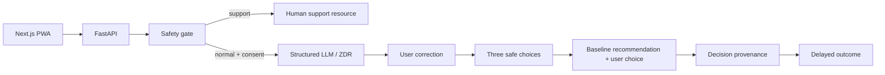

# JournalPulse Research Beta

[](https://render.com/deploy?repo=https%3A%2F%2Fgithub.com%2Fyusenrong46-afk%2FJournalPulse%2Ftree%2Fcodex%2Fjournalpulse-research-beta)

JournalPulse is a privacy-aware, non-clinical reflection product and an adaptive-intervention research
platform. A mobile-first Next.js PWA guides a person from writing, through correcting a bounded
affective-state estimate, to choosing a target and trying one approved activity. FastAPI enforces safety,
consent, user ownership, policy logging, delayed outcomes, export, and deletion.

This branch deliberately retires the consumer-facing BERT/LSTM emotion classifier. OpenRouter provides
optional structured perception through strict JSON Schema and zero-data-retention routing. It does not
choose arbitrary links: every displayed resource comes from the reviewed catalog. The active policy is a
transparent fixed baseline; adaptive policy and episodic memory flags remain off until their evidence
gates pass.

> JournalPulse is not therapy, diagnosis, treatment, or crisis care. Support mode directs people to
> human help and bypasses the LLM, memory, and policy exploration.

## What exists now

- Next.js 16 / TypeScript PWA with onboarding, Today, five-stage Reflect, a short Talk
  conversation, Action, Check-in, searchable History, trajectory Patterns, and Privacy flows.
- Responsive scientific-journal interface with an icon-led mobile shell, explicit processing status,
  encrypted draft recovery, stable offline fallback, and WCAG-focused interaction states.
- FastAPI contracts for analysis, a bounded Luna conversation, curated-action preview, explicit
  user overrides, saved reflections, delayed outcomes, trajectories, pending check-ins, resources,
  export, and deletion.
- Deterministic safety precedence and consent-aware OpenRouter structured extraction.
- Authenticated analysis endpoints, bounded request sizes/rates, provider retries, and request trace IDs.
- Supabase Auth validation, Postgres schema, tested user scoping, and RLS policies.
- Atomic, idempotent reflection and outcome writes through authenticated Postgres functions.
- Curated HTTPS resource catalog; the model cannot generate destinations.
- Opt-in AES-GCM encrypted recovery for one unfinished device-local draft, expiring after 24 hours.
- Manual 16-week research curriculum and a feature-flagged policy boundary. The curriculum lives in
  the research-track document.

## Architecture


```mermaid
flowchart LR
  PWA["Next.js PWA"] --> API["FastAPI"]
  API --> SAFE["Safety gate"]
  SAFE -->|support| HUMAN["Human support resource"]
  SAFE -->|normal + consent| LLM["Structured LLM / ZDR"]
  LLM --> CORRECT["User correction"]
  CORRECT --> CATALOG["Three safe choices"]
  CATALOG --> POLICY["Baseline recommendation + user choice"]
  POLICY --> DB["Decision provenance"]
  DB --> OUTCOME["Delayed outcome"]
```

See [the architecture](docs/ARCHITECTURE_V1.md), [operations runbook](docs/OPERATIONS.md), and
[manual research track](docs/RESEARCH_TRACK.md).
The recoverable pre-rebuild demo is tagged `v0.4-demo`.

## Local launch

Requires Python 3.12 and Node 22.

```bash
uv sync --frozen --extra dev
cp .env.example .env
# Add a newly rotated OpenRouter key to JOURNALPULSE_LLM_API_KEY in .env.
# Guided reflection uses JOURNALPULSE_LLM_MODEL (default openai/gpt-6-luna) with
# reasoning effort medium. Talk uses JOURNALPULSE_CHAT_MODEL (default openai/gpt-6-luna)
# at the same effort, and JOURNALPULSE_CHAT_TIMEOUT_SECONDS (default 45).
uv run python scripts/verify_openrouter.py
# A paid two-turn Luna check. Run only when explicitly authorized:
# uv run python scripts/verify_conversation.py
uv run uvicorn journalpulse.api:app --reload --port 8000
```

In a second terminal:

```bash
cd web
npm ci
npm run dev
```

Open `http://localhost:3000`. Local development uses the configured development UUID; production rejects
that header and requires a Supabase bearer token. Apply the SQL migration in `supabase/migrations/` before
using Supabase. The API automatically loads the repository's ignored `.env` file, while real process
environment variables take precedence. `OPENROUTER_API_KEY` is accepted as an alias. Put credentials only
in local or deployment secrets. Never reuse a credential exposed in chat or source control.
`/ready` remains `not_ready` while the LLM feature is enabled without a key; the live verification
command confirms that the configured provider accepts a real schema-constrained request.

## Cloud preview

The Render blueprint builds the Next.js PWA as a static export, packages it into the FastAPI image, and
serves both from one origin. This keeps the UI and API on one URL, avoids cross-origin drift, compresses
static assets, and persists the preview database on a 1 GB Render disk.

```bash
git push origin codex/journalpulse-research-beta
```

Create a Render Blueprint from this repository and select `render.yaml`. The checked-in blueprint starts
in `preview` mode with deterministic local reflection and a browser-specific pseudonymous profile. It is
appropriate for a personal cloud preview, not a public multi-user beta: the preview identity header is not
an authentication boundary.

Before inviting other users, apply the Supabase migrations, add `SUPABASE_URL` and `SUPABASE_ANON_KEY`,
set `JOURNALPULSE_ENV=production`, and add a newly rotated `JOURNALPULSE_LLM_API_KEY` as a Render secret.
Then enable `JOURNALPULSE_LLM_ENABLED=true` and require `/ready` to report Supabase plus configured AI.
Never deploy the OpenRouter credential previously exposed in chat.

## Verification

```bash
uv run ruff check src tests scripts
uv run mypy src
uv run python scripts/export_openapi.py --check
uv run pytest --cov=journalpulse --cov-report=term-missing
uv run python scripts/validate_resources.py
cd web
npm run lint && npm run typecheck && npm run test:unit && npm run build && npm run test:e2e
JOURNALPULSE_STATIC_EXPORT=true npm run build
```

Mocks validate request contracts in CI. Release evidence for model promotion must use a rotated secret and
real OpenRouter calls against frozen cases; no live result is claimed by this repository yet.
