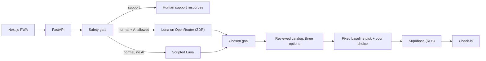

# JournalPulse

JournalPulse is a calm check-in companion. You talk with **Luna** for a minute, confirm how you feel,
pick one small thing to try from a reviewed list, and later tell Luna whether it helped. Over time your
Journey shows which small steps help you most.

Live site: <https://journalpulse.vercel.app>

> JournalPulse is not therapy, diagnosis, treatment, or crisis care. When a message suggests possible
> danger, Luna skips the AI and points to people who can help right away (9-8-8 in Canada).

## How it works

1. **Talk.** Luna asks how you're arriving. Tap a mood face or type.
2. **Check the feeling.** Luna suggests up to three feelings; you keep, remove, or add your own.
3. **Choose what would help.** *Calm down*, *Get some energy back*, *Make sense of it*, *Feel less
   alone*, or *Take one small step*.
4. **Try one small thing.** Three options from the reviewed catalog, with Luna's pick first. An
   optional timer helps you give it a fair go.
5. **Check in.** Later, Home asks "Did it help?" with five faces. Each check-in grows a plant in your
   Journey garden.

With AI allowed, Luna's replies come from `openai/gpt-6-luna` through OpenRouter with zero data
retention. Without AI, a scripted Luna asks the same questions, so the app never dead-ends.

## Screens

| Screen | Purpose |
|---|---|
| Home | Greeting, "Talk with Luna", any check-in that is due, and a peek at your garden |
| Chat (`/talk`) | The whole check-in: mood, conversation, feelings, goal, actions, timer |
| Check-in | "Did you try it?", "How much did it help?", optional feelings and a note |
| Journey | Your garden, what helps you, how you've been feeling, and past check-ins |
| Me | AI and message settings, check-in timing, how Luna works, download, delete, sign out |
| Welcome | Three short onboarding screens, including Smart Luna vs Simple Luna |

See [the design guide](docs/DESIGN.md) for the visual system and Luna's moods.

## Architecture


```mermaid
flowchart LR
  PWA["Next.js PWA"] --> API["FastAPI"]
  API --> SAFE["Safety gate"]
  SAFE -->|support| HUMAN["Human support resources"]
  SAFE -->|normal + AI allowed| LLM["Luna on OpenRouter (ZDR)"]
  SAFE -->|normal, no AI| GUIDED["Scripted Luna"]
  LLM --> GOAL["Chosen goal"]
  GUIDED --> GOAL
  GOAL --> CATALOG["Reviewed catalog: three options"]
  CATALOG --> POLICY["Fixed baseline pick + your choice"]
  POLICY --> DB["Supabase (RLS)"]
  DB --> OUTCOME["Check-in"]
```

- **Frontend:** Next.js 16, React 19, TypeScript, exported as static files.
- **Backend:** FastAPI on Python 3.12. The same app serves the API and, in production, the static site.
- **Data:** Supabase Auth (email magic link) and Postgres with row-level security. Local development uses
  SQLite.
- **AI:** OpenRouter with a strict JSON schema and zero-data-retention routing. The model never picks
  links; every action comes from `assets/resources/catalog.json`.

Details are in [the architecture document](docs/ARCHITECTURE.md).

## Repository layout

```text
app.py                     Vercel entrypoint (loads src/journalpulse/api.py)
src/journalpulse/          FastAPI app: safety, AI, guided Luna, policy, persistence
web/                       Next.js app (pages in web/app, Luna in web/components/luna.tsx)
assets/resources/          Reviewed action catalog
supabase/migrations/       Postgres schema, RLS policies, and write functions
scripts/                   Build, contract, and live-verification scripts
tests/                     Backend tests (pytest)
web/tests/                 Frontend unit (Vitest) and browser (Playwright) tests
docs/                      Architecture, design, operations, research, and release evidence
```

## Run it locally

Requires Python 3.12, [uv](https://docs.astral.sh/uv/), and Node 22.

```bash
uv sync --frozen --extra dev
cp .env.example .env          # add JOURNALPULSE_LLM_API_KEY to use Smart Luna
uv run uvicorn journalpulse.api:app --reload --port 8000
```

In a second terminal:

```bash
cd web
npm ci
npm run dev
```

Open <http://localhost:3000>. Leave the Supabase variables empty to skip sign-in locally; the browser
then uses a local test identity and the API stores data in SQLite. Without an OpenRouter key, Luna runs
in Simple mode.

## Configuration

Server variables (set on the host; `.env` is only a local fallback):

| Variable | Default | Purpose |
|---|---|---|
| `JOURNALPULSE_ENV` | `local` | `production` requires Supabase, a model key when AI is on, and a non-local CORS origin |
| `JOURNALPULSE_LLM_API_KEY` | — | OpenRouter key (`OPENROUTER_API_KEY` also works) |
| `JOURNALPULSE_LLM_ENABLED` | `true` | Turns AI off everywhere when `false` |
| `JOURNALPULSE_CHAT_MODEL` | `openai/gpt-6-luna` | Model for Luna's chat |
| `JOURNALPULSE_LLM_MODEL` | `openai/gpt-6-luna` | Model for the legacy structured analysis endpoint |
| `JOURNALPULSE_CHAT_TIMEOUT_SECONDS` | `45` | Chat request timeout |
| `JOURNALPULSE_LLM_ZDR` | `true` | Zero-data-retention routing; the chat client refuses to run without it |
| `JOURNALPULSE_ANALYSIS_RATE_LIMIT_PER_MINUTE` | `20` | Per-person AI request limit |
| `SUPABASE_URL`, `SUPABASE_ANON_KEY` | — | Supabase Auth and database; the anon key is public |
| `JOURNALPULSE_WRITE_SIGNING_KEY` | — | Signs writes that carry server provenance; the same key goes in `private.server_secrets`. Required in production |
| `JOURNALPULSE_CORS_ORIGINS` | platform URL | Comma-separated origins; defaults to the Vercel or Render URL |
| `JOURNALPULSE_WEB_DIST` | — | Folder of the exported site to serve from FastAPI |
| `JOURNALPULSE_MEMORY_ENABLED`, `JOURNALPULSE_ADAPTIVE_POLICY_ENABLED` | `false` | Research flags; keep off |

Browser variables (baked in at build time): `NEXT_PUBLIC_SUPABASE_URL`, `NEXT_PUBLIC_SUPABASE_ANON_KEY`,
and, for local development only, `NEXT_PUBLIC_API_BASE_URL` and `NEXT_PUBLIC_DEV_USER_ID`. The Vercel
and Docker builds copy the Supabase values from the server variables automatically.

Never commit real keys. Rotate any key that has been pasted into chat, an issue, or a commit.

## Deploy

**Vercel (current production).** `vercel.json`, `app.py`, and `scripts/build_vercel_web.py` build the
site into `web-dist/` and run FastAPI as one function. Set the server variables above on the Vercel
project, then run `vercel deploy --prod`. After the first deploy, add the Vercel URL to Supabase under
**Authentication → URL configuration** (Site URL and `https://<your-domain>/**` as a redirect URL).

**Render (alternative).** `render.yaml` defines a free Docker web service from `Dockerfile.api`. Create
a Blueprint from this repository and paste `JOURNALPULSE_LLM_API_KEY` and `SUPABASE_ANON_KEY` when asked.

Apply `supabase/migrations/` in filename order and store the signing key in the database and on the
host before deploying. The full sequence is in the [operations runbook](docs/OPERATIONS.md).

## Test

```bash
uv run ruff check src tests scripts
uv run mypy src
uv run python scripts/export_openapi.py --check
uv run pytest --cov=journalpulse
uv run python scripts/validate_resources.py

uv run python scripts/verify_postgres_schema.py

cd web
npm run lint && npm run typecheck && npm run test:unit
npm run build && npm run test:e2e
npm run test:integration
```

There are two browser suites. `test:e2e` checks the interface with the API mocked in the browser.
`test:integration` runs the browser against the real FastAPI app, PostgREST 12, and PostgreSQL with every
migration applied (`scripts/integration_stack.py`); only the token issuer and the model provider are
stand-ins.

CI runs all of these on every push and pull request. `scripts/verify_postgres_schema.py` applies the
migrations to a real PostgreSQL 16 database and checks RLS, signed provenance, lifecycle races between
two sessions, retention, the shared rate limit, and deletion.
Two scripts make paid live calls and are run only on purpose: `scripts/verify_openrouter.py` and
`scripts/verify_conversation.py`.

## Privacy and safety

- The safety check runs on every message before anything else. Support mode never calls the model.
- AI is opt-in. Requests use zero-data-retention routing, and logs never contain message text or keys.
- A chat's words are cleared when it ends, or after 24 hours idle, unless you choose to keep them. A
  scheduled database job enforces the 24 hours even if you never come back. A short summary, your
  confirmed feelings, the goal, and your chosen action are saved.
- A reply that arrives after a chat was closed, accepted, or deleted is refused by the database, so it
  cannot reopen the chat or bring back cleared words.
- Records of which model, policy, and safety rule were used can only be written by the server.
- Download or delete everything from the Me page. Deleting journal data keeps your sign-in.

## Documentation

- [Architecture](docs/ARCHITECTURE.md): request flow, chat stages, data model, and module boundaries
- [Design](docs/DESIGN.md): colours, type, motion, Luna's moods, and writing voice
- [Operations](docs/OPERATIONS.md): deployment, readiness, failure behaviour, recovery, rollback
- [Research track](docs/RESEARCH_TRACK.md): the manual 16-week plan for adaptive policies and memory
- [Release evidence](docs/RELEASE_EVIDENCE.md): what has been verified, and what is still open

The retired classifier and Streamlit demo are preserved at the `v0.4-demo` tag.
