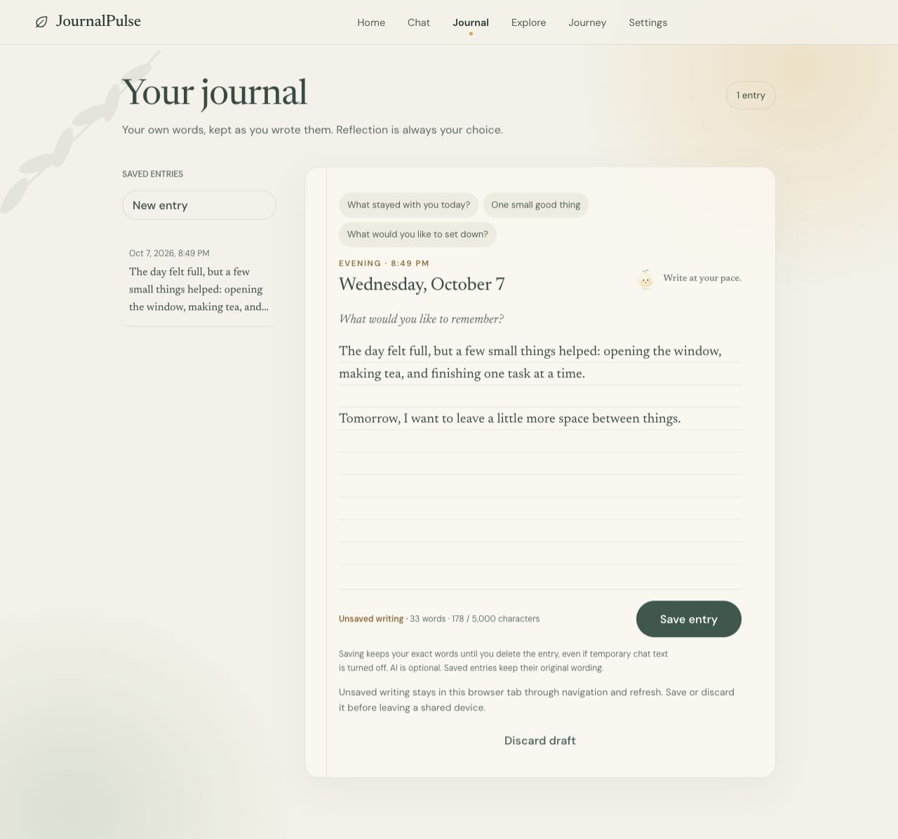
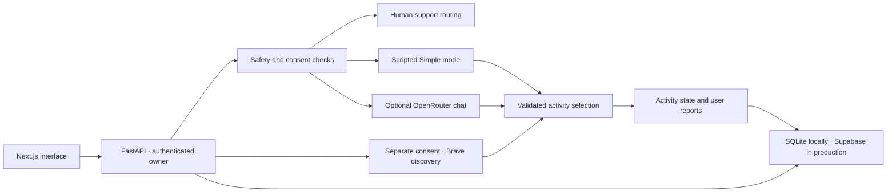

# JournalPulse

**A quiet place to write, reflect, and choose one small next step.**

JournalPulse is a deployed research beta for people who want to keep their own words,
talk through a day with Luna, and see what helped afterward. Journaling works on its own;
AI chat and the scripted **Simple mode** are separate, optional choices.

[Try JournalPulse](https://journalpulse.vercel.app) · [Engineering guide](docs/ENGINEERING.md) ·
[Run locally](#run-locally) · [Operations](docs/OPERATIONS.md)



*Real app, fictional writing. Captured locally on October 7, 2026 with AI and external search
disabled. The draft shown here was restored after refresh. [Capture scope and text walkthrough](docs/ENGINEERING.md#demonstration).*

## The experience

1. **Write at your pace.** Save the exact words you wrote. Unsaved journal and chat drafts recover
   within the current browser tab session, including after navigation and refresh.
2. **Choose how to reflect.** Talk with Luna using AI, or use the limited scripted flow without it.
   Sharing a saved entry requires an explicit choice; an unlinked chat cannot read your journal.
3. **Pick one small activity.** Accept a suggestion, browse reviewed app activities, choose another
   goal, or keep talking. External resource discovery asks separately before sharing a general topic.
4. **Check in honestly.** Report whether you tried the activity and what changed. Your reports build
   the Journey view. A timer reaching zero never counts as participation.

Setup is optional. Private defaults remain active until you choose otherwise.

## Three engineering decisions

| Decision | What it protects | Inspect it |
|---|---|---|
| **Writing survives a page change.** Account-scoped tab drafts and a save coordinator outside the journal page keep the submitted text and receipt stable. A late save preserves newer typing and does not pull you away from another page. | The user's words, even when navigation and responses overlap. | [Draft store](web/lib/tab-session.ts), [save coordinator](web/lib/journal-save.ts), [regressions](web/tests/unit/journal-workspace.test.tsx) |
| **AI use has deliberate boundaries.** Explicit consent, one selected source entry, constrained activity choices, and separate topic-only search. Unavailable search offers reviewed alternatives. | A journaling action should not silently become a provider request. | [Journal routes](src/journalpulse/journals.py), [conversation routes](src/journalpulse/conversations.py), [discovery](src/journalpulse/discovery.py) |
| **Activity state belongs to the database.** Modern activities use server deadlines, revisions and replayable receipts. Hosted writes enforce ownership and server provenance; reported participation is separate from timer state. | Refreshes, concurrent tabs, stale replies and uncertain retries. | [Activity lifecycle](src/journalpulse/activity_lifecycle.py), [activity routes](src/journalpulse/activity_sessions.py), [PostgreSQL checks](scripts/verify_activity_schema.py) |

## Architecture


```mermaid
flowchart LR
  WEB["Next.js interface"] --> API["FastAPI · authenticated owner"]
  API --> GATE["Safety and consent checks"]
  GATE --> SUPPORT["Human support routing"]
  GATE --> SIMPLE["Scripted Simple mode"]
  GATE --> AI["Optional OpenRouter chat"]
  API --> SEARCH["Separate consent · Brave discovery"]
  SIMPLE --> CHECK["Validated activity selection"]
  AI --> CHECK
  SEARCH --> CHECK
  CHECK --> STATE["Activity state and user reports"]
  API --> DB["SQLite locally · Supabase in production"]
  STATE --> DB
```

The browser handles presentation and tab drafts. FastAPI checks ownership, consent and safety;
the repository layer persists journal, chat and activity records. Simple mode makes no model call.
Search and AI output are validated before becoming a saved activity.

**Stack:** Next.js 16 · React 19 · TypeScript · FastAPI · Python 3.12 · Supabase Auth/Postgres/RLS.
Production serves the exported frontend and API together on Vercel. Local development uses SQLite.
Optional providers are OpenRouter for Luna and Brave for search. There is no custom trained NLP
model in the active application; adaptive-policy and memory research flags remain off.

## Run locally

Requires **Python 3.12**, **Node 22**, and [uv](https://docs.astral.sh/uv/).
From a fresh checkout, install the locked dependencies and start the API:

```bash
uv sync --frozen --extra dev
cp .env.example .env
JOURNALPULSE_LLM_ENABLED=false JOURNALPULSE_SEARCH_ENABLED=false \
  uv run uvicorn journalpulse.api:app --reload --port 8000
```

In another terminal:

```bash
cd web
npm ci
npm run dev
```

Open [localhost:3000](http://localhost:3000), write a sample entry, visit Home, then return to
Journal and refresh. The draft should remain; Save entry adds it to the saved list.
With the example's empty Supabase settings, this uses a local development identity and SQLite.
AI and search are disabled by the API command, so this first result needs no paid provider.

Stop both processes with **Ctrl+C**. Local saved records remain at the configured database path
(by default `artifacts/research_beta.db`); drafts last only for the browser tab session.
The [engineering guide](docs/ENGINEERING.md#reproduction) records the verification conditions.
Hosted configuration, secrets, migrations and rollback belong in the [operations runbook](docs/OPERATIONS.md).

## Verification and limits

The October 7 repair snapshot passed **1,270 backend tests**, **217 frontend unit tests**,
**46 browser checks with mocked APIs**, and **22 integrations through the real API, PostgREST
and PostgreSQL**. Backend line coverage was **91.88%**. Four optional integration tours were skipped.
[Verification scope and reproduction](docs/ENGINEERING.md#verification).

Synthetic production checks also exercised writing recovery, saving, optional setup, activity
recovery and consented resource discovery. These are bounded workflow checks. They do not establish
clinical benefit, model quality, load capacity or reliability for every device and network.

> JournalPulse is not therapy, diagnosis, treatment or crisis care. Its limited phrase-based
> support routing can miss distress. In a crisis in Canada, call or text [9-8-8](https://988.ca/).

Privacy choices have different lifetimes: saved journal entries remain until deleted; tab drafts
are temporary; chat words may be cleared while summaries, reported feelings and activity choices
remain saved. The [privacy contract](docs/ENGINEERING.md#privacy-and-safety-boundaries) explains
idle cleanup, provider routing and their limits.

## Explore the repository

- [Engineering](docs/ENGINEERING.md): current contracts, state transitions, code tour, tradeoffs and tests
- [Design](docs/DESIGN.md): visual language, Luna, motion and writing voice
- [Operations](docs/OPERATIONS.md): configuration, readiness, retention, release and recovery
- [Architecture background](docs/ARCHITECTURE.md): original reflection/chat design; current activity additions are in Engineering
- [Research track](docs/RESEARCH_TRACK.md) and [historical release evidence](docs/RELEASE_EVIDENCE.md): dated work, not current evaluation results

The retired classifier and Streamlit demo are preserved at the
[`v0.4-demo` tag](https://github.com/yusenrong46-afk/JournalPulse/tree/v0.4-demo).
