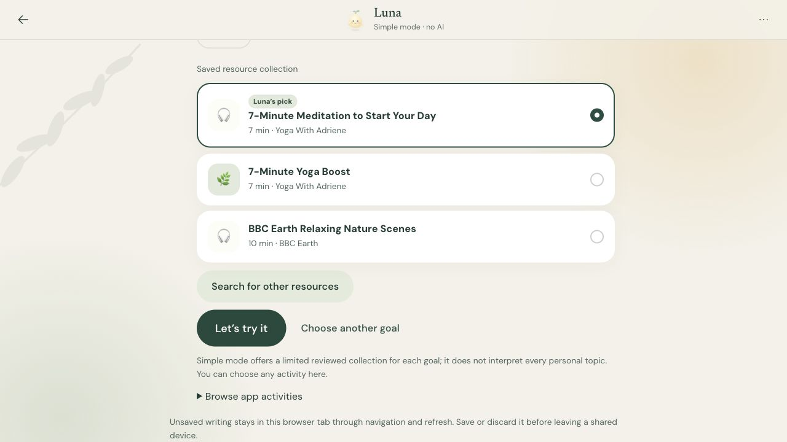
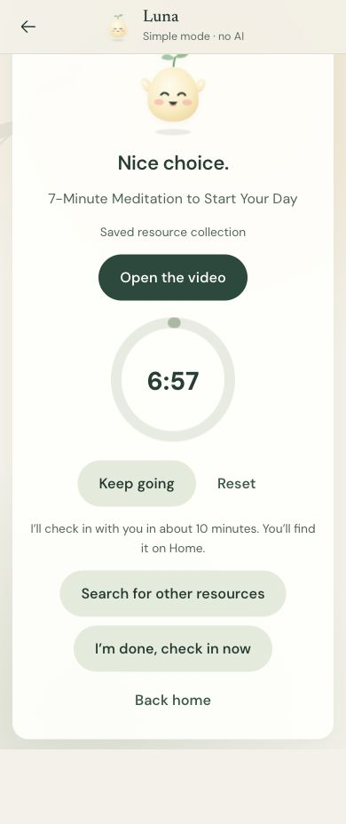

# JournalPulse · engineering guide

JournalPulse turns a journal entry or conversation into an optional, constrained next step,
then records what the person actually reports. The interesting problem is keeping that sequence
consistent across privacy choices, navigation, provider failures, concurrent writes and deletion.

This guide describes the application and audit repairs published in October 2026. The six
October 7 workflow repairs extend the existing schema; they require no additional migration.
Earlier design and evaluation reports remain useful history, but their candidate status and
test totals should not be read as the current release state.

## Input and output contract

| User action | Accepted input | Result and boundary |
|---|---|---|
| Save a journal entry | Exact writing, account identity and a stable request receipt | An owner-bound entry. Saving does not request an AI reflection. Saved entries retain their original wording. |
| Reflect on an entry | One owned saved entry plus explicit AI consent | A temporary reply; navigating away or refreshing clears the displayed reflection. It does not rewrite the entry. |
| Talk with Luna | A message, current conversation identity and privacy choices; optionally one explicitly shared entry | An owner-bound conversation. An unlinked chat has no journal-wide read access. Simple mode is scripted; AI mode calls the configured model. |
| Select an activity | A validated offered resource, an approved discovery token, or an explicit reviewed-catalog choice | A saved choice/session with provenance. An unknown resource, invalid token or inaccessible source is refused. Selection and starting are distinct actions for modern activities. |
| Control a modern activity | Session ID, expected revision, request receipt and explicit start/pause/resume/reset/stop | A server-backed state transition. Stale revisions conflict; replaying the same receipt returns the established result. |
| Check in | Reported participation, perceived helpfulness, optional feelings/note and a stable receipt | The report is persisted before an optional follow-up. Timer expiry is not evidence that an activity was performed. |
| Find a resource | A validated general topic, source exclusions and scoped sharing approval | Brave snippets and a validated selection. Journal text is not imported into Explore. In-chat discovery uses constrained activity vocabulary. |

API contracts are in [the generated OpenAPI document](../web/openapi.json) and
[frontend types](../web/lib/generated-api.ts). Two additive interfaces support recovery:
`GET /v1/capabilities` returns discovery `configured` or `unavailable` without contacting a provider
or exposing credentials; conversation detail can include `accepted_reflection`, resolved by the
authenticated owner and exact saved reflection ID. **Configured is not a live-provider health check.**

## Code tour

| Area | Start here | Responsibility |
|---|---|---|
| Request entry and configuration | [api.py](../src/journalpulse/api.py), [config.py](../src/journalpulse/config.py), [auth.py](../src/journalpulse/auth.py) | App factory, routes, readiness, development/hosted identity and provider gates |
| Writing and recovery | [journal page](../web/app/journal/page.tsx), [tab-session.ts](../web/lib/tab-session.ts), [journal-save.ts](../web/lib/journal-save.ts), [journals.py](../src/journalpulse/journals.py) | Immediate drafts, navigation-independent saves, exact text and source deletion |
| Conversation | [talk page](../web/app/talk/page.tsx), [conversations.py](../src/journalpulse/conversations.py), [guided.py](../src/journalpulse/guided.py), [guided_action.py](../src/journalpulse/guided_action.py) | Scripted and AI paths, privacy, revisions, accepted-chat recovery and validated offers |
| Activity and check-in | [activity_lifecycle.py](../src/journalpulse/activity_lifecycle.py), [activity_sessions.py](../src/journalpulse/activity_sessions.py), [workspace](../web/components/activity-session-workspace.tsx) | Owned state, deadlines, transition receipts, reports and follow-up |
| Resource discovery | [discovery.py](../src/journalpulse/discovery.py), [inline_discovery.py](../src/journalpulse/inline_discovery.py), [reviewed catalog](../assets/resources/catalog.json) | Topic constraints, consent, retrieved-source validation and reviewed fallback |
| Persistence and deletion | [persistence.py](../src/journalpulse/persistence.py), [erasure.py](../src/journalpulse/erasure.py), [migrations](../supabase/migrations) | SQLite/PostgREST implementations, RLS, signed provenance, erasure revisions and replay boundaries |
| Safety and selection | [safety.py](../src/journalpulse/safety.py), [policy.py](../src/journalpulse/policy.py), [signing.py](../src/journalpulse/signing.py) | Phrase routing, deterministic constraints and server-authorized provenance |
| Deployment | [app.py](../app.py), [vercel.json](../vercel.json), [build script](../scripts/build_vercel_web.py) | One FastAPI deployment serving API routes and the exported Next.js app |

The tour follows the main product and audit paths. Research evaluators, every legacy endpoint and
every historical artifact have not been re-evaluated as part of the documentation refresh.

## Writing that survives navigation

The tab store saves edits immediately rather than waiting for component unmount. Its keys separate
accounts, the journal draft, and each conversation's identity, incarnation and source entry.
Drafts use `sessionStorage`; blocked storage falls back to route-shared memory with a disclosure
and a departure warning. Memory fallback cannot survive a refresh.

The journal save coordinator sits outside the page. It holds exact text, request UUID, account
and erasure boundary until confirmation. Retrying an uncertain write reuses the receipt.
Completion invalidates/reconciles the saved-entry list, but cannot redirect a user who left the
journal. It clears only the version submitted: writing entered while the request runs remains.
Old list responses cannot hide the newly saved entry.

Draft clearing is explicit and scoped: successful submission, Discard, chat ending, source deletion,
sign-out and account erasure clear the applicable writing. Account and data revision checks refuse
late responses from an earlier identity or erasure boundary.

Explore restores its topic and source exclusions within the tab session. It resets sharing approval
when the flow is re-entered; restored text never grants consent or automatically starts a search.
Home offers optional setup instead of redirecting unfinished accounts. Completing setup returns
to the intended internal route, including its query parameters.

Tests: [draft/account isolation](../web/tests/unit/tab-session.test.ts),
[save races](../web/tests/unit/journal-workspace.test.tsx),
[source deletion](../web/tests/unit/journal-delete-order.test.tsx),
[optional setup](../web/tests/unit/optional-onboarding.test.tsx).

## Two activity paths, two timer authorities

Modern chat activities reuse the existing server-backed session. The API validates the current
owner, chat/source lifecycle, revision and resource constraints before a write. A running timer
uses a stored server deadline. Pausing stores the remaining duration; resuming establishes the
new deadline. Refresh and backgrounding do not restart the exercise.

The older Simple-mode acceptance flow closes the chat and saves a reflection/decision. Recovery
loads that exact accepted reflection, restores the activity/check-in links, and keeps the composer
closed. Its timer is local to the tab: an account- and decision-scoped record holds the running
deadline, paused remainder or reset state. It is not a cross-device timer. Neither timer turns
elapsed time into reported participation. Deleted or inaccessible records are not revived.

Manual reviewed-catalog selection is explicit (`user_selected`), constrained by the current
activity rules and recorded as a user choice rather than a model selection. Simple mode uses a
finite collection for each goal. Choosing the same goal retains that collection and explains its
scope instead of appending duplicate exchanges.

Tests: [activity database gates](../scripts/verify_activity_schema.py),
[legacy timer recovery](../web/tests/unit/action-timer-recovery.test.tsx),
[closed chat recovery](../tests/test_conversations_api.py),
[browser/API regressions](../web/tests/integration/audit-repairs.spec.ts).

## Privacy and safety boundaries

- **AI is optional.** Onboarding and routine navigation do not enable it. Sharing a journal entry,
  obtaining a reflection and searching externally have explicit controls appropriate to their scope.
- **Retention is not one switch.** Saved journal entries remain until deletion. Open-chat words are
  persisted for resumption; when message retention is off they are cleared at chat end or idle
  cleanup. Summaries, reported feelings and activity choices remain saved. Modern activity selection
  does not itself close the chat; the legacy acceptance path does.
- **Idle cleanup has scheduling limits.** Hosted cleanup targets more than 24 hours of inactivity,
  plus the 15-minute schedule, lock delays and any outage. Readiness reports schedule and observed
  completion separately. It is not an exact 24-hour deletion guarantee.
- **Tab drafts are convenience storage.** They are neither a durable backup nor a guarantee of
  physical erasure from a device. A shared device still needs care.
- **Provider routing is a requirement, not independent retention proof.** AI requests require
  OpenRouter zero-data-retention routing. The app cannot independently verify a provider's practices.
- **Support routing is limited.** A phrase check runs before model use; matched support flows avoid
  the model. It can miss distress and is not a clinical assessment.
- **Search sources have limits.** Selections are checked against returned candidates, but discovery
  reads snippets rather than independently verifying full pages, quality or benefit. Availability
  failure offers reviewed alternatives and explicit retry actions.
- **Hosted ownership is enforced twice.** The API uses the authenticated identity; Postgres applies
  RLS and signed server provenance. Erasure and revision guards reject stale writes. Local SQLite
  development is a different environment and does not prove hosted authorization.

See [operations](OPERATIONS.md) for readiness, retention monitoring, schema gates and rollback.

## Demonstration

These are actual screenshots of the app with **fictional sample data**, captured October 7, 2026.
The static frontend ran against real FastAPI and disposable SQLite, with no Supabase sign-in,
AI calls, external search calls or output substitution. No video was produced.

| Capture | What happened | What it does not prove |
|---|---|---|
| [Journal](../assets/showcase/journal.jpg) | Typed a fictional entry, navigated away and returned, refreshed, then saved exact writing. The image shows a restored draft beside the previously saved sample. | Production auth, provider behavior or every storage failure |
| [Guided choices](../assets/showcase/guided-chat.jpg) | Sent a fictional message, skipped to feelings, confirmed Overwhelmed and chose Calm down; the real scripted flow returned its finite reviewed collection. | Personalized AI interpretation or live search |
| [Phone activity](../assets/showcase/activity-mobile.jpg) | Accepted the legacy seven-minute activity, started and paused the timer, then refreshed. It returned paused at 6:57 with activity/check-in links. | Performing the exercise, server-backed timing or cross-device recovery |





The desktop capture used the browser's default 1280 × 720 viewport; the full journal page is taller.
The phone capture used a **390 × 844 viewport**, with document width also 390 pixels. Full-page
screenshots preserve the actual UI and its scroll position; they are selected states, not a
continuous recording or performance measurement.

## Verification

The October 7 repair source snapshot produced these results. The product/test files carried to
main were compared byte-for-byte with that tested repair snapshot before publication.

| Layer | Observed result | Scope |
|---|---|---|
| Backend | 1,270 passed; 91.88% coverage, with branch measurement enabled | Unit/API tests, SQLite behavior, validation, safety, ownership and failure cases |
| Frontend unit | 217 passed across 33 files | State, draft isolation, blocked storage, response races, consent, timers and check-in deadlines |
| Browser with API mocks | 46 passed | Desktop/mobile flows and accessibility checks; provider/database behavior is not exercised |
| Real-stack browser integration | 22 passed; four optional tours skipped | Browser → FastAPI → PostgREST 12 → PostgreSQL 16, real migrations; token issuer and providers are stand-ins |
| Database release gates | Passed | Fresh scratch schema, owner/source lifecycle, signed writes, replay, concurrency, retention and erasure |
| Synthetic production workflow checks | Completed for audit repairs | Writing/navigation/save recovery, optional setup, activity recovery, disclosure and consented Brave/OpenRouter discovery; narrow samples |

The [release-gates workflow](../.github/workflows/ci.yml) runs on pushes to **main** and pull requests.
Current GitHub run results are available in [Actions](https://github.com/yusenrong46-afk/JournalPulse/actions/workflows/ci.yml).
OpenAPI and generated frontend types must agree; lint, type checking and resource validation are
also release gates. Live-provider scripts are separate and make paid calls only when intentionally run.

The reported check-in delay was investigated with synthetic data. Local and production observations
did not establish the original report as a reproducible performance defect. The UI now gives progress
feedback after three seconds and bounds each explicit save attempt to 15 seconds, including auth
and revision work. Unconfirmed answers and their receipt remain available for retry. The production
sample included browser automation overhead, so it is not presented as a latency benchmark.

Mechanical checks and limited production probes do not qualify the model's responses, establish
therapeutic effectiveness, prove load capacity or cover every browser/device. Historical evaluator
reports refer to their own frozen prompts and cohorts, not automatically to today's product.

## Reproduction

Use the [README quickstart](../README.md#run-locally) for a no-AI first run. The showcase was checked
on a prepared macOS machine with Python 3.12.13, Node 22.23.3 and already-installed locked
dependencies. The exported frontend was built afresh and the local flows above were exercised.
The Next.js development server also passed the README's draft/navigation/refresh/save example,
using an explicit local API-port override because port 8000 already had an unrelated service.
This is not a clean-room package-installation claim.

```bash
uv run ruff check src tests scripts
uv run mypy src
uv run python scripts/export_openapi.py --check
uv run pytest --cov=journalpulse
uv run python scripts/validate_resources.py
```

From `web/`:

```bash
npm run lint
npm run typecheck
npm run test:unit
npm run generate:api
npm run build
npm run test:e2e
npm run test:integration
```

Integration and schema checks require an existing PostgreSQL 16/pgvector service and the
PostgreSQL client. Set `JOURNALPULSE_PG_DSN` to a disposable loopback database; the scratch helpers
reject hosted DSNs. The [CI workflow](../.github/workflows/ci.yml) lists every schema verifier and
its prerequisites. Never point a scratch verifier at production.

Configuration reference: [.env.example](../.env.example) and [Settings](../src/journalpulse/config.py).
AI needs the existing OpenRouter key, model and ZDR settings; search additionally needs
`JOURNALPULSE_SEARCH_ENABLED=true` and `JOURNALPULSE_SEARCH_API_KEY` for Brave.
Hosted mode needs Supabase Auth, the ordered migrations and matching database/API write-signing
keys. Browser Supabase values are public build inputs; server provider/signing secrets must never
use a `NEXT_PUBLIC_` variable. Readiness and capability endpoints never spend a provider call.

## Tradeoffs and remaining work

Tab-session recovery avoids a persistent local archive of personal writing, but it cannot recover
after the tab session ends. Memory fallback is less resilient still. Stable receipts make explicit
retry safer, while conflicts remain visible rather than being silently overwritten.

Static export keeps the UI/API deployment together. The service worker caches only the offline
fallback; fresh deployment assets are fetched from the network to avoid reviving obsolete bundles.
Offline reading/writing is not an offline server-save guarantee.

The reviewed collection is small and predictable; Simple mode cannot interpret every personal
topic. AI allows richer conversation but adds cost, timeout, validation and model-quality concerns.
Brave discovery expands the source set without turning snippets into independently reviewed content.
Manual choices retain deterministic resource constraints without pretending a model selected them.

Next evaluation work includes a frozen current-product model assessment, broader human usability
feedback, production load measurement and more device coverage. Adaptive policy and memory remain
research work behind disabled flags. Changes should extend the existing consent, provenance,
ownership and erasure contracts rather than bypass them.
