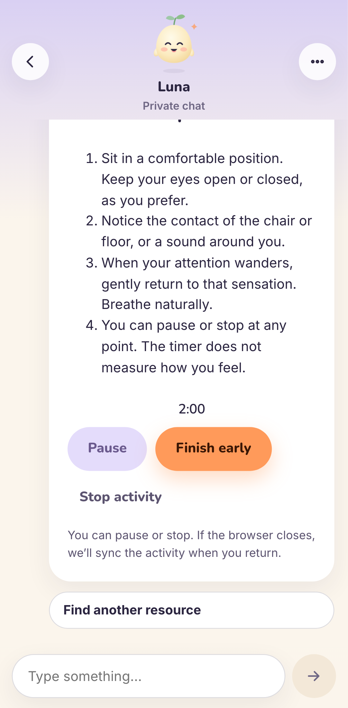
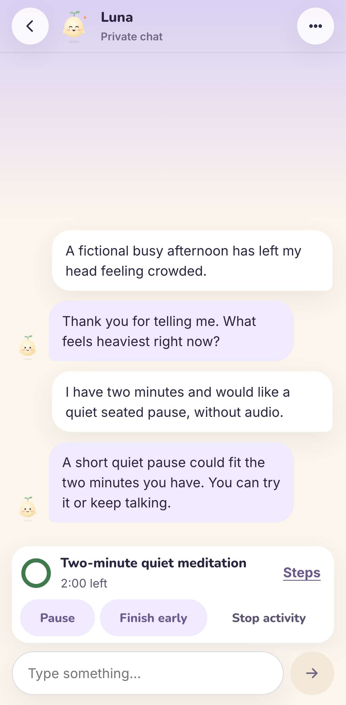
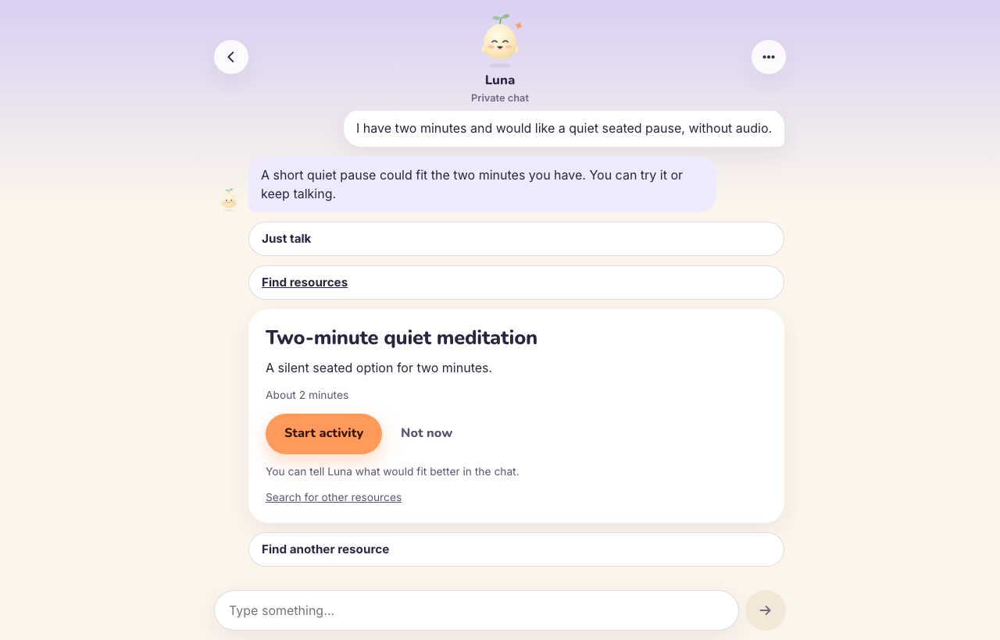
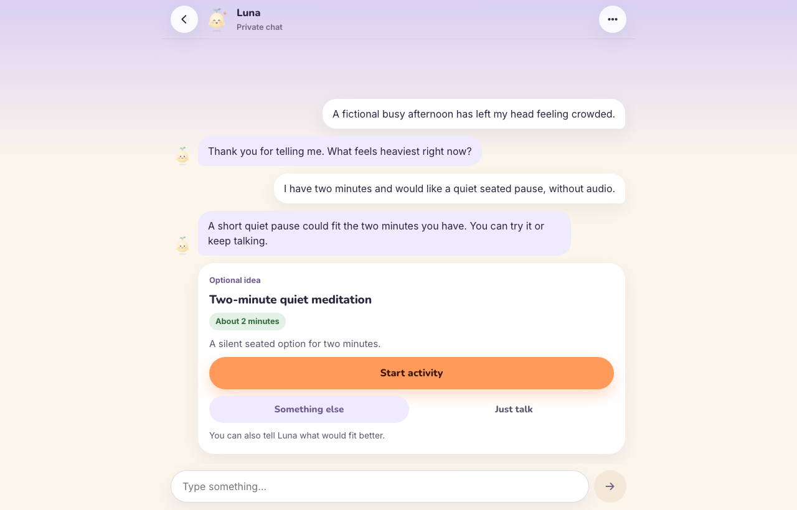
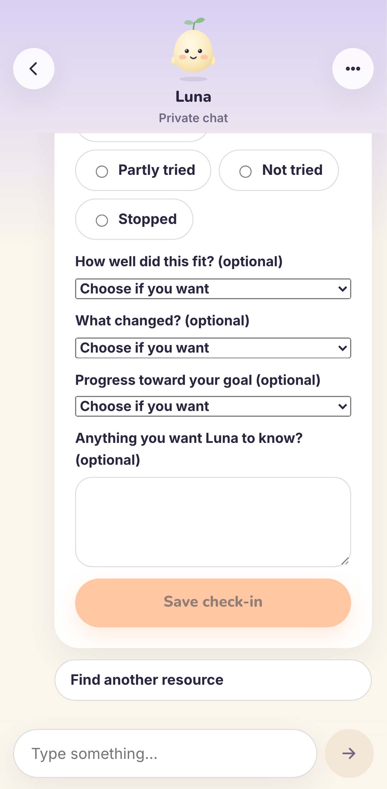
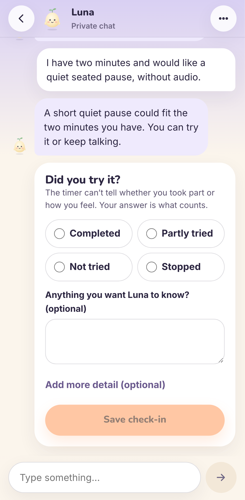

# Luna audit, repairs and chat redesign — October 5, 2026

**Verdict.** The local build is ready for review. It is not deployed. Six confirmed defects were
fixed with regression tests. One more is recorded but deferred, because fixing it needs a
shared-database migration. The `/talk` screen was redesigned around the conversation. Every local
gate passes. No paid model or search calls were made. The `.3` skill, the frozen benchmark and the
shared Supabase project were not changed. This is engineering verification, not clinical or
model-quality validation.

- Start: `e0bceab` (clean `main`). End: the eight commits after it on `main`, not pushed.
- Evidence: [`artifacts/luna-ui-audit/`](../artifacts/luna-ui-audit/). It holds the baseline,
  final logs, desktop and mobile screenshots before and after, per-commit patches, and
  dependency audit output.

## Findings

| # | Severity | What happened | Cause | Status |
|---|---|---|---|---|
| F1 | P1 | A Luna turn could outlast Vercel's 120s limit. The default worst case was about 110s, and allowed settings reached about 375s. The browser retried at 60s while the first call could still reach Luna. | Each retry used the full chat timeout, regardless of time already spent. | **Fixed.** Attempts share a 100s budget. Readiness rejects a timeout that cannot fit. The browser now waits 125s. |
| F2 | P1 (safety) | The router missed "everyone would be better off without me", "ending it all", "I feel suicidal" and "I won't be around much longer". Past statements ("I used to want to die but therapy helped") locked the chat in support mode, which closes the composer. | English phrase list with no indirect patterns and no sense of time. | **Fixed (narrowly).** Indirect first-person patterns were added. A past marker counts only if the same clause has no present marker. Reported risk about someone else still routes to support. |
| F3 | P2 | Activity check-ins from chat never appeared in the Home or Journey garden. | Reports were written only to `activity_sessions`; the gardens read legacy outcomes. | **Fixed.** `GET /v1/activity-history` returns an owner-only, minimal view. Plants grow only from the person's own rating, never from the timer. |
| F4 | P3 | Saving a different offer marks the earlier unstarted one `declined`, which hides it from Luna's later choices. | Both SQLite and the PostgreSQL function use `declined`, while the supersede path uses `stopped`. | **Deferred.** Pinned as a strict expected failure in `tests/test_inline_discovery.py`. The fix needs a new migration on the shared project. |
| F5 | P2 (supply chain, test only) | The integration stack ran any `postgrest` it found and extracted an unverified Linux-only download. | No hash or version check. | **Fixed.** Pinned SHA-256 hashes, recorded on first use because upstream publishes none. Version checks, atomic install, and a macOS arm64 build. |
| F6 | Info | `braces` advisory GHSA-vfj7-8cjw-p6xm. | Dev-only chain through `eslint-config-next`. | **Unchanged.** The production tree has 0 npm findings and Python has 0. No patched `braces` exists, and npm's suggested downgrade was not applied. |
| U1 | P2 | The mobile keyboard closed after every message. | The composer was disabled while sending, which drops focus. | **Fixed.** The composer is read-only during a reply. |
| U2 | P2 | With a journal-entry chooser open over another chat, typing sent the message into that chat without the entry, while the screen still offered the entry. | The composer ignored the chooser state. | **Fixed.** It waits for a choice. No entry text was ever sent. |
| U3 | P2 (a11y) | Small sage tags measured about 4.4:1 contrast. | Token pair below AA. | **Fixed** (5.5:1). Axe now checks every captured chat state. |
| T1 | P3 | Two browser checks were flaky: axe measured text mid-fade, and one test read a request before it was recorded. | Timing races. | **Fixed.** 138/138 over three repeats. |

The three items the handoff described as already fixed were checked against existing tests rather
than reimplemented:
- Your message appears before Luna's reply (`journal-chat.test.tsx`).
- Stale buttons disappear after Listen or Stop (`activity-session.test.tsx`, `loop.spec.ts`).
- A newer offer replaces an unstarted one (`guided-action.spec.ts`).

All of them still pass.

Earlier audit claims that were re-confirmed in code: a failed Luna call saves nothing
(`test_ai_provider_failure_atomicity.py`), and activity commands, reports and follow-ups use retry
receipts.

## What changed in the UI

| Before | After |
|---|---|
|  |  |
|  |  |
|  |  |

- **Chat first.**
  - The header is compact.
  - Short chats sit near the composer.
  - The log follows new messages only when you are already at the bottom; otherwise a
    "New messages" button appears.
  - The composer grows with your text and stays above a mobile keyboard.
- **One optional offer.**
  - A single card: *Start activity*, *Something else* (opens the consented search), and *Just talk*.
    An offer you saved from search shows *Not now* instead of *Just talk*.
  - Four overlapping search links were reduced to one in AI chats. The resource library is still on
    Home.
- **Compact activity.** While an activity runs, a bar above the composer holds the timer ring,
  Pause/Resume, Finish early, Stop and the steps. The conversation stays readable and you can keep
  talking.
- **One honest check-in.**
  - The only required question is "Did you try it?", with a note that the timer can't tell.
  - Optional ratings sit behind "Add more detail".
  - A short receipt shows until Luna's single follow-up arrives.
- **Journal context.** A strip names the entry's date and how long ago it was written, and says
  that how you feel now may differ.
- **Garden.** Journey adds a list of "Activities from your chats". "Not tried" stays a seed rather
  than a failure.

The [design canvas](https://claude.ai/artifact/Cyv8Fy6hP2rNL5PEkEKbZx) shows the target. The
implementation keeps the real API's check-in fields, which the canvas simplified.

## Verification (final run, local)

| Check | Result |
|---|---|
| ruff, mypy, OpenAPI check, resources | pass |
| `pytest --cov` | 745 passed, 1 expected failure (F4), 91% coverage |
| Four PostgreSQL verifiers (disposable local `pgvector:pg16`) | pass (activity verifier: 72 assertions) |
| `npm ci`, lint, typecheck, `generate:api` (no diff), build | pass (Node 22.23.3) |
| Unit tests | 114 passed |
| Browser checks (mobile and desktop, axe on 9 routes) | 46 passed |
| Integration (browser → API → PostgREST → PostgreSQL) | 18 passed |
| UI tour with axe on 16 states (`JP_SCREENSHOT_DIR`) | 4 passed |

Luna, Brave and sign-in are deterministic stand-ins in the browser and integration runs. These
results show behaviour and layout, not live model quality.

**Not run:**
- Live Luna or Brave, and any paid evaluation.
- Hosted preview or production checks, and deployment.
- Real iOS Safari or Android keyboards. Keyboard handling was tested only in Chromium emulation.
- Screen-reader walkthroughs.
- Load testing.

## Remaining risks

- **Safety routing is still an English phrase list.** "I can't see any way out" is still missed
  (pinned as a known gap). The history guard is a new judgment and has had no clinical review. The
  `s05_physical_warning` uncertain grade from the benchmark is unchanged and still open.
- **Before deploying, check the hosted `JOURNALPULSE_CHAT_TIMEOUT_SECONDS`.** A value above 95 now
  fails readiness on purpose. Only the variable's name was inspected, not its value.
- **F4** remains until a reviewed migration is applied to both stores.
- **PostgREST hashes** pin what was downloaded on 2026-10-05. They do not prove the upstream
  build is authentic. The CI Postgres image is still a floating tag; this run used digest
  `sha256:7b822b0a…b90a`.
- **The UI tour** dismissed the "end current chat?" dialog in the baseline run, which is how U2
  was found. The final tour accepts it.

## Manual check (about 10 minutes)

1. On a phone, open Talk and send two messages. The keyboard should stay open.
2. Say: "My head feels crowded after work. I would like a one-minute silent, seated meditation,
   without audio or video." Check that one card appears, and that *Something else* and *Just talk*
   both work.
3. Start the activity. While the timer runs, scroll up, send a message, and pause, then resume.
   The bar should stay compact.
4. Let it expire, or tap *Finish early*. There should be one check-in. Save **Not tried**. Luna
   should reply once, and the receipt should then disappear.
5. Open Journey. The activity should appear under "Activities from your chats" as "Didn't try it".
6. From a journal entry, choose *Discuss with Luna* while another chat is open. You should not be
   able to type until you choose. The strip should show the entry's date and age.
7. Optional check of the routing, using fictional text: send "I used to want to die but therapy
   helped". The chat should stay open. "Everyone would be better off without me" should show
   support.
