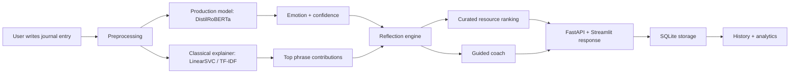

# Emotion Journal Assistant Technical Guide

This document is written for someone starting from zero. It explains:

- what the project is trying to do
- why the architecture looks the way it does
- what every major package is for
- what each important source file does
- what background knowledge you need to understand the code
- how data, models, APIs, the UI, and persistence fit together

## 1. Project in One Paragraph

Emotion Journal Assistant is a small applied-AI product for reflective journaling. A user writes a journal entry, the app predicts one of six emotions, explains the prediction with phrase-level signals, generates structured follow-up reflection prompts, surfaces curated coping resources such as videos, websites, and browser-safe games, and offers a constrained guided coach. The system is built as a product, not just a notebook: it has a training pipeline, a FastAPI backend, a Streamlit front end, a SQLite database, saved model artifacts, and automated tests.

## 2. Main Goal of the Project

The goal is not to build a therapist or diagnosis system.

The goal is to show end-to-end product and ML capability:

- natural language processing
- model benchmarking
- model inference
- explainability
- API design
- UI design
- local persistence
- analytics
- safety-aware product behavior

That makes the project much stronger for a portfolio than a single notebook.

## 3. What Problem the App Solves

Many beginner NLP projects stop at:

- load data
- train model
- print accuracy

This project goes further:

1. The user writes about a real emotional experience.
2. The model predicts the strongest emotion.
3. The app turns that prediction into a reflection experience.
4. The app stores the result and tracks what resources the user found helpful.
5. The user can inspect history and analytics over time.

## 4. Product Boundaries

This is a wellness reflection tool.

It is not:

- therapy
- mental health diagnosis
- crisis counseling
- a freeform emotional advice bot

When the app detects crisis language, it deliberately stops the normal journaling flow and switches to a safety-oriented response with urgent support links.

## 5. Emotion Labels

The app uses the `dair-ai/emotion` dataset and predicts exactly six labels:

- `sadness`
- `joy`
- `love`
- `anger`
- `fear`
- `surprise`

These are defined centrally in `src/emotion_journal/config.py`.

## 6. High-Level Architecture



## 7. Active Tech Stack

### Runtime stack

- Backend API: FastAPI
- Web UI: Streamlit
- Database: SQLite
- Production NLP model: PyTorch + Hugging Face Transformers
- Classical explainer model: scikit-learn

### Training stack

- Dataset loading: Hugging Face `datasets`
- Data handling: pandas, numpy
- Classical modeling: scikit-learn
- Transformer fine-tuning: PyTorch + Transformers

### Quality stack

- Testing: pytest
- API testing: httpx
- Model persistence: joblib, safetensors

## 8. Why These Model Choices

### Why not only a classical model?

Classical text models like Logistic Regression or LinearSVC work well on TF-IDF features and are fast and interpretable. But pretrained transformers usually capture language meaning better, especially when wording is subtle or context matters.

### Why use a transformer for production?

The production model is `distilroberta-base`, a smaller RoBERTa-family transformer. It gives the project a stronger NLP story than an LSTM and performs better than the classical baselines on macro F1.

### Why keep a classical model?

The project keeps a classical linear model because it is very useful for phrase-level explanation. Linear models can tell us which words or n-grams pushed the score upward for a class. That makes them useful even when the transformer is the main prediction model.

### Why no ensemble in the current version?

An ensemble can help, but it also adds complexity, calibration issues, and more maintenance. For this version, the project chooses one strong production model plus one strong explainer model rather than combining multiple models.

## 9. Current Model Results

From the latest saved evaluation:

- Logistic Regression: `0.8295` accuracy, `0.7264` macro F1
- LinearSVC: `0.8795` accuracy, `0.8224` macro F1
- DistilRoBERTa transformer: `0.9000` accuracy, `0.8600` macro F1

Interpretation:

- The transformer is best overall, so it is the production model.
- LinearSVC clearly beats Logistic Regression as the classical baseline, so it becomes the explainer model.

## 10. Project Layout

The important project files are:

```text
app/streamlit/app.py
assets/resources/catalog.json
scripts/train.py
src/emotion_journal/
tests/
artifacts/models/
artifacts/reports/
README.md
requirements.txt
pyproject.toml
```

## 11. What Each Package in `requirements.txt` Is For

### Backend and API packages

- `fastapi`
  - Builds the REST API.
  - Used for endpoints like `/predict`, `/entries`, `/analytics`, `/resources`, and `/coach/respond`.

- `uvicorn`
  - ASGI server used to run FastAPI locally.
  - Think of it as the process that actually serves the API over HTTP.

- `pydantic`
  - Validates request and response schemas.
  - Ensures that incoming JSON has the right shape and types.

- `httpx`
  - Used in tests for API calls.
  - Also used by the optional OpenAI-compatible coach rewriter.

### UI package

- `streamlit`
  - Builds the user interface quickly.
  - Used for the journaling input page, history page, insights page, and model explanation page.

### ML and NLP packages

- `scikit-learn`
  - Used for classical text models.
  - Provides `TfidfVectorizer`, `LogisticRegression`, `LinearSVC`, pipelines, and evaluation metrics.

- `pandas`
  - Used for tabular data manipulation.
  - Important in dataset preparation, analytics, and displaying history/insights.

- `numpy`
  - Used for array math, probability operations, and general ML numeric utilities.

- `joblib`
  - Saves and loads scikit-learn pipelines.
  - Used for the explainer baseline artifact.

- `datasets`
  - Loads the `dair-ai/emotion` dataset from Hugging Face.

- `torch`
  - The deep learning framework used for transformer training and inference.

- `transformers`
  - Provides pretrained tokenizers and transformer models.
  - Used to fine-tune and load `distilroberta-base`.

- `safetensors`
  - Secure and efficient format used when saving transformer weights.

### Visualization and analysis packages

- `matplotlib`
  - General plotting library.
  - Present in the environment for analysis/reporting support, though Streamlit charts currently handle most UI visualization.

- `seaborn`
  - Statistical plotting helper built on top of matplotlib.
  - Useful for confusion matrices or future analysis notebooks/scripts.

### Testing package

- `pytest`
  - Runs unit tests and integration tests.

## 12. Important Config and Global Constants

File: `src/emotion_journal/config.py`

This file is the single source of truth for many project-wide settings:

- project directories
- artifact directories
- database location
- resource catalog location
- label map
- model names
- confidence thresholds
- crisis copy and keywords
- LLM environment variable names

Why this matters:

- it avoids hard-coding values all over the codebase
- it makes behavior more consistent
- it makes future changes easier

## 13. Data Layer

### Source dataset

File: `scripts/train.py`

The training script:

- downloads `dair-ai/emotion`
- converts each split to pandas
- prepares `train`, `validation`, and `test`

The data-loading helper lives inside the training script because it is only used
when retraining the model. That keeps the app package focused on runtime code.

### Preprocessing

File: `src/emotion_journal/preprocessing.py`

This module standardizes text by:

- lowercasing
- removing URLs
- removing punctuation
- collapsing repeated whitespace

It also checks for crisis language.

Important idea:

The same preprocessing logic should be reused consistently. If training and inference preprocess text differently, model quality usually gets worse.

## 14. Classical NLP Background

To understand the classical models, you need three ideas.

### TF-IDF

TF-IDF turns text into numeric features.

Very simply:

- each word or word pair becomes a feature
- the value is higher when the word is important in that document
- very common words are downweighted

This lets classical ML algorithms operate on text.

### Logistic Regression

Logistic Regression is a linear classifier. For multiclass text classification:

- it learns weights for words and phrases
- positive weights push prediction toward a class
- negative weights push away from a class

It is easy to interpret and often a strong baseline.

### LinearSVC

LinearSVC is another linear classifier that often performs very well on sparse text features.

In this project:

- it outperformed Logistic Regression
- it became the classical explainer baseline

One subtle point:

`LinearSVC` does not naturally expose probabilities like Logistic Regression does. The project approximates probabilities from its `decision_function` using a softmax transformation when needed.

## 15. Transformer Background

To understand the production model, you need these ideas.

### Tokenizer

A tokenizer converts text into token IDs that a transformer understands.

### Pretrained language model

A pretrained model has already learned general language patterns from huge text corpora before fine-tuning on this specific emotion task.

### Fine-tuning

Fine-tuning means:

- start from a pretrained model
- add a classification head
- train it further on labeled emotion data

### Why `distilroberta-base`

It is a smaller, faster transformer than full RoBERTa while still being strong enough for a portfolio-quality NLP project.

## 16. Training Pipeline

File: `scripts/train.py`

This is the central training script. It does the following:

1. Sets random seeds for reproducibility.
2. Loads dataset splits.
3. Prepares a normalized text column for classical models.
4. Trains Logistic Regression.
5. Trains LinearSVC.
6. Fine-tunes the transformer.
7. Evaluates all models on the same test split.
8. Chooses the best classical explainer.
9. Chooses the best production model.
10. Saves model artifacts and evaluation reports.

### Why there are two selection steps

There are really two roles:

- best production predictor
- best classical explainer

That is why the script does not just pick one model and throw everything else away.

## 17. Inference Layer

Files:

- `src/emotion_journal/model.py`
- `src/emotion_journal/experience.py`

### `model.py`

This is the core inference module.

It defines:

- `Prediction` dataclass
- `BaselineExplainer`
- `ArtifactPredictor`
- artifact loading logic
- phrase-level explanation logic
- sklearn inference logic
- transformer inference logic

It can load either:

- a scikit-learn pipeline
- a Hugging Face transformer artifact

### Prediction output contains more than a label

The prediction object includes:

- emotion
- confidence
- recommendation
- disclaimer
- crisis flag
- per-class scores
- support message
- model name
- confidence band
- reflection summary
- interpretation
- follow-up prompts
- explanation phrases

That means the app prediction layer is already product-oriented, not just model-oriented.

### `experience.py`

This is the module that assembles a complete user experience:

- prediction
- recommended resources
- initial coach turn

It is useful because it keeps the API and Streamlit app from duplicating business logic.

## 18. Reflection Engine

File: `src/emotion_journal/recommendations.py`

This module is one of the most important product layers.

It turns a prediction into user-facing reflection output using deterministic templates.

It defines:

- recommendation headlines
- summary templates
- interpretation templates
- follow-up prompt pools
- confidence band logic
- crisis override behavior

### Why deterministic templates instead of an LLM by default?

Deterministic generation is:

- easier to control
- safer
- cheaper
- easier to test
- easier to explain in interviews

The app only uses optional LLM rewriting for coach wording, not for core prediction, safety, or ranking decisions.

## 19. Explainability Layer

File: `src/emotion_journal/model.py`

The `BaselineExplainer` class provides phrase-level explanation using the classical linear model. It now lives in `model.py` beside `ArtifactPredictor`, because it explains the predictor's output and is easier to understand there.

How it works:

1. Transform the normalized text with TF-IDF.
2. Look at the classifier coefficients for the predicted class.
3. Measure which present features contributed most.
4. Return the top contributing phrases.

Why this matters:

- it makes the app more transparent
- it gives the user a clue about what the system noticed
- it gives you a strong technical story in interviews

## 20. Resource Recommendation System

Files:

- `assets/resources/catalog.json`
- `src/emotion_journal/resources.py`

### Catalog

The resource catalog is curated and stored locally. Each resource has metadata such as:

- `id`
- `title`
- `url`
- `resource_type`
- `coping_style`
- `provider`
- `embed_kind`
- `duration_minutes`
- `summary`
- `emotion_tags`
- `tone_tags`
- `is_browser_safe`
- `is_crisis_safe`

### Why curated instead of live search?

Curated links are better here because they are:

- safer
- more stable
- easier to demo
- easier to explain
- easier to test

### Ranking logic

The resource ranking module:

- filters by emotion
- respects crisis safety
- optionally filters by coping style
- boosts resources the user previously marked as helpful
- lowers the ranking of dismissed resources

This is a simple but real personalization layer.

## 21. Guided Coach

Files:

- `src/emotion_journal/coach.py`
- `src/emotion_journal/llm.py`

### Coach philosophy

The coach is intentionally constrained.

It is not open-ended therapy chat.

Instead, it operates like a small state machine with controlled intentions:

- open reflection
- clarify mixed emotion
- move to resources
- close the loop

### State machine

The coach tracks a small state dictionary with values like:

- `step`
- `framing_emotion`
- `selected_coping_style`
- `turns`
- `is_crisis`

### Why this is a good design

It keeps the product:

- safer
- easier to debug
- easier to test
- easier to explain technically

### Optional LLM layer

The coach can optionally rewrite its wording through an OpenAI-compatible API adapter.

Important:

- the LLM does not choose the emotion
- the LLM does not rank resources
- the LLM does not control safety behavior
- the LLM only polishes wording

This is a strong design pattern because it keeps critical logic deterministic.

## 22. Persistence Layer

File: `src/emotion_journal/db.py`

This file manages the SQLite database.

### Main table: `journal_entries`

It stores:

- raw text
- predicted emotion
- confidence
- recommendation
- location
- activity
- feedback
- reflection summary
- interpretation
- confidence band
- model name
- support message
- follow-up prompts as JSON text
- explanation phrases as JSON text
- coach summary
- suggested resource IDs as JSON text

### Second table: `resource_interactions`

It stores:

- resource ID
- action (`opened`, `helpful`, `dismissed`)
- emotion
- optional journal entry ID
- timestamp

### Lazy migrations

The database initialization function adds missing columns when needed. This is helpful because older local databases do not break when the schema grows.

## 23. Analytics Layer

File: `src/emotion_journal/analytics.py`

This module computes:

- total entries
- counts by emotion
- trend buckets by date
- feedback counts
- usefulness rate
- confidence-band counts
- top explanation phrases by emotion
- resource interaction counts
- most helpful resources
- preferred coping styles

This is a product layer, not just a data-science layer. It powers the Insights page in Streamlit.

## 24. API Layer

Files:

- `src/emotion_journal/api.py`
- `src/emotion_journal/schemas.py`

### Why FastAPI is a good fit

FastAPI is excellent for ML prototypes and portfolio apps because it gives:

- clean routing
- automatic validation
- auto-generated docs
- easy integration with Python ML code

### Main endpoints

- `GET /health`
- `POST /predict`
- `POST /entries`
- `PATCH /entries/{id}/feedback`
- `GET /entries`
- `GET /analytics`
- `GET /resources`
- `GET /resources/summary`
- `POST /resource-interactions`
- `POST /coach/respond`

### Role of `schemas.py`

This module defines the request and response contracts:

- journal input
- journal entry creation
- feedback update
- prediction response
- journal entry response
- analytics response
- resource card
- coach request/response

This matters because:

- the API becomes self-documenting
- bad input is rejected early
- frontend/backend integration becomes cleaner

## 25. Streamlit UI

File: `app/streamlit/app.py`

The Streamlit app is the main public demo surface.

### Pages

- `New Entry`
  - write a journal entry
  - run prediction
  - see reflection output
  - see explanation phrases
  - choose what kind of support would help right now
  - browse resource tabs
  - interact with the coach
  - save the reflection

- `Resource Library`
  - browse the curated resource catalog
  - filter by emotion, resource type, and coping style
  - inspect catalog coverage and validation status

- `History`
  - inspect saved entries and summaries

- `Insights`
  - inspect trends, counts, preferred coping styles, and resource usefulness

- `About the Model`
  - inspect metadata and evaluation report

### Why Streamlit works well here

It is fast to build and good enough to demonstrate:

- input forms
- results
- tabs
- charts
- session state
- simple interactive workflows

## 26. Saved Artifacts

Important artifact files:

- `artifacts/models/production.json`
- `artifacts/models/baseline.joblib`
- `artifacts/models/transformer_model/...`
- `artifacts/reports/evaluation.json`
- `artifacts/reports/evaluation.md`

### What `production.json` does

It tells the app:

- which model type is active
- which model name is active
- where its artifact lives
- what labels exist
- what metric selected it
- what its metrics were

This is the bridge between training and runtime.

### Legacy artifacts

You may notice old files like:

- `artifacts/models/lstm_model.keras`
- `artifacts/models/lstm_tokenizer.json`

Those are leftovers from an earlier TensorFlow/LSTM phase and are not part of the active V3 architecture.

## 27. Testing Strategy

Files:

- `tests/test_core.py`
- `tests/test_api.py`
- `tests/test_model_smoke.py`

### What gets tested

- text normalization
- crisis keyword detection
- confidence band logic
- support-response crisis override
- phrase-level explanation
- database CRUD
- schema migration behavior
- analytics output
- resource recommendation behavior
- coach flow behavior
- API happy paths
- API validation failures
- saved-artifact predictor smoke test

### Why this matters

This proves the project is software, not just code that works once on one machine.

## 28. End-to-End Flow of a Single User Entry

Here is the full path when a user writes text.

1. User submits journal text in Streamlit.
2. Streamlit calls the shared experience builder.
3. Predictor loads the active production artifact.
4. Text is tokenized or vectorized depending on model type.
5. The production model returns class probabilities.
6. The top class becomes the predicted emotion.
7. The classical explainer extracts influential phrases.
8. The reflection engine builds:
   - headline recommendation
   - summary
   - interpretation
   - follow-up prompts
9. Resource ranking selects curated links.
10. Coach generates an opening state and message.
11. The UI displays the result.
12. If the user saves the entry, SQLite persists it.
13. If the user interacts with resources, those events are logged.
14. Analytics update from accumulated history.

## 29. Safety Design

This project includes a basic safety layer, not a full mental-health safety system.

### Current safety approach

- keyword-based crisis detection
- crisis-specific disclaimer
- crisis-specific support message
- ordinary prompts suppressed in crisis mode
- entertainment-style resources suppressed in crisis mode
- urgent support links promoted

### Why this matters

Even though this is not a clinical product, the app should not respond to clearly unsafe text with normal upbeat journaling advice.

## 30. Background Knowledge You Should Learn to Understand the Project

If you want to understand the whole project well, learn these topics in roughly this order:

1. Python packaging basics
2. pandas and DataFrames
3. text preprocessing in NLP
4. TF-IDF vectorization
5. linear classifiers for text
6. train/validation/test splits
7. evaluation metrics:
   - accuracy
   - precision
   - recall
   - F1
   - macro F1
   - confusion matrix
8. transformer basics:
   - tokenization
   - embeddings
   - fine-tuning
9. PyTorch basics
10. FastAPI request/response flow
11. Streamlit session state and widgets
12. SQLite basics
13. testing with pytest

## 31. Why Macro F1 Matters Here

This is a multiclass classification problem with classes that are not equally common.

Macro F1:

- computes F1 for each class separately
- averages them equally

That makes it a better selection metric than plain accuracy when you care about smaller classes such as `surprise` and `love`, not just the biggest classes.

## 32. Common Questions a New Teammate Might Ask

### Why are there both normalized and raw text fields?

Raw text is better for transformer tokenization and for saved journal history.

Normalized text is useful for classical TF-IDF models and crisis keyword checks.

### Why not use the LLM for everything?

Because:

- deterministic logic is easier to trust
- it is cheaper
- it is easier to test
- it gives a cleaner technical story

### Why keep SQLite instead of a cloud database?

For a single-user portfolio app, SQLite is:

- simple
- fast
- local
- good enough

### Why Streamlit and FastAPI both?

Streamlit is the demo UI.

FastAPI is the service/API layer.

Having both proves the project can support:

- product demo workflows
- programmatic access
- better architecture separation

## 33. How to Run the Project

### Streamlit app

```bash
cd "/Users/thomas/Documents/New project"
source .venv/bin/activate
PYTHONPATH=src streamlit run app/streamlit/app.py
```

### FastAPI server

```bash
cd "/Users/thomas/Documents/New project"
source .venv/bin/activate
PYTHONPATH=src uvicorn emotion_journal.api:app --reload
```

### Training

```bash
cd "/Users/thomas/Documents/New project"
source .venv/bin/activate
PYTHONPATH=src python scripts/train.py
```

### Tests

```bash
cd "/Users/thomas/Documents/New project"
source .venv/bin/activate
PYTHONPATH=src pytest
```

## 34. How to Read the Codebase Efficiently

If you are new, read files in this order:

1. `README.md`
2. `docs/TECHNICAL_GUIDE.md`
3. `src/emotion_journal/config.py`
4. `src/emotion_journal/model.py`
5. `src/emotion_journal/recommendations.py`
6. `src/emotion_journal/resources.py`
7. `src/emotion_journal/coach.py`
8. `src/emotion_journal/api.py`
9. `app/streamlit/app.py`
10. `scripts/train.py`
11. `tests/`

This order gives you:

- product understanding first
- then system wiring
- then modeling details
- then tests

## 35. Likely Future Improvements

Recently completed upgrade areas:

- configurable second-transformer benchmark support
- formal calibration metrics and confidence-band accuracy reporting
- structured crisis detection beyond simple keyword substring matching
- resource admin tooling for validation and proposed catalog additions
- richer but still safe coach summary persistence
- Streamlit Cloud deployment configuration and documentation
- Altair-based insight charts and model confusion-matrix views

## 36. Final Mental Model

The simplest way to think about the system is:

- transformer = best predictor
- classical linear model = explainer
- reflection engine = turns prediction into structured guidance
- resource engine = turns emotion into actionable links
- coach = structured follow-up interaction
- SQLite = memory
- FastAPI = service layer
- Streamlit = demo product layer

If you understand those eight pieces and how they connect, you understand the project.
